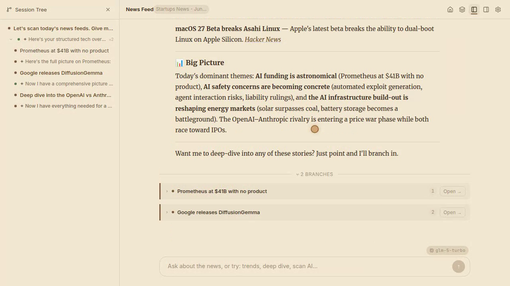

# pi-tree

**AI made everyone a faster producer. Nobody's becoming a better reader.**

Pi-tree is for the input side of knowledge work. Load your books, news feeds, or research papers — an AI reads them *with* you, not as a flat Q&A, but as branching conversations that capture how you actually think about the material. Go deep on a concept, branch into a tangent, zoom back out. Your reading path is a navigable tree, not a disposable chat log.

> **Local-first, bring your own key.** Runs entirely on your machine. No cloud account, no subscription. Works with cloud APIs (DeepSeek, Gemini, Claude) or fully offline with [Ollama](https://ollama.com) / local models.

<p align="center">
  <a href="https://shuowu.github.io/pi-tree/">
    
  </a>
  <br />
  <sub><a href="https://shuowu.github.io/pi-tree/">📖 Documentation</a> · <a href="https://shuowu.github.io/pi-tree/vision">Vision</a></sub>
</p>

## The Problem

Every AI assistant can summarize a book, answer questions about an article, or extract key points from a paper. But they all treat understanding as a step to skip — paste text in, get the answer out, move on. There's no structure, no persistence, no sense of *journey* through the material.

Real comprehension isn't linear. You branch — *"wait, how does this connect to X?"* — then come back. You re-read something with new context. You accumulate a personal vocabulary of terms and ideas. Flat chat threads can't capture any of this.

**Pi-tree fixes this.** Each source — a book, a news feed, a research paper — gets a tree-structured conversation where:

- **Branches happen on semantic shifts** — go deeper, switch topics, follow a tangent — each gets its own branch with full context preserved
- **You can zoom in and out** — dive deep on a concept, then pull back with a summary without losing your place
- **Every user gets their own tree** — multiple people can explore the same source independently, each with their own conversation, glossary, and history
- **The conversation IS the reading** — no separate "reader" and "chat." The AI surfaces content as quotes within the conversation
- **Everything stays local** — your sources, sessions, questions, and intellectual journey never leave your machine

## Getting Started

### Prerequisites

[Node.js](https://nodejs.org/) 22+, npm.

### Local setup

```bash
cp .env.example .env   # edit with your API key and provider
npm install
npm run dev
```

Dev server runs on `:3947`, client on `:5947`. Open http://localhost:5947.

### Docker

```bash
cp .env.example .env   # edit with your API key

docker run -d --name pi-tree \
  --env-file .env \
  -p 3847:3847 \
  -v pi-tree-data:/data \
  ghcr.io/shuowu/pi-tree:latest
```

Open http://localhost:3847 (serves both frontend and API).

**Or build from source:**

```bash
docker compose up --build
```

> [!TIP]
> Full setup options → [Docker guide](https://shuowu.github.io/pi-tree/docs/docker)

## Models

Pi-tree doesn't need frontier-class models — reading and comprehension are more about context and conversation than raw reasoning. Smaller, faster models work well and keep costs low (or free with local inference).

**Cloud APIs** (cheapest options that work well):

| Provider | Model | Notes |
|----------|-------|-------|
| DeepSeek | `deepseek-v4-flash` | Very cheap, strong reading comprehension |
| Google | `gemini-2.5-flash` | Fast, large context window |
| Anthropic | `claude-haiku-4-20250514` | Fast, great quality-to-cost ratio |
| Zhipu | `glm-5-turbo` | Good Chinese + English bilingual support |

**Local models** — completely offline, no API costs. Use [Ollama](https://ollama.com/download) or [LM Studio](https://lmstudio.ai/). Gemma 4 (12B) and Qwen 3.6 are good starting points.

```bash
PI_PROVIDER=openai                              # Ollama/LM Studio expose an OpenAI-compatible API
PI_API_KEY=not-needed
PI_BASE_URL=http://localhost:11434/v1            # Ollama default
PI_MODEL=gemma4:12b
```

> [!TIP]
> Multiple providers, runtime switching, and more → [Models & Providers](https://shuowu.github.io/pi-tree/docs/models)

## Content Sources

Pi-tree supports multiple source types. No content is included in this repository.

- **Books** — upload via the Library UI (EPUB, MOBI, PDF)
- **News feeds** — add RSS/Atom feeds through the UI; pi-tree crawls, deduplicates, and presents them as conversational sources

> [!IMPORTANT]
> Users are responsible for ensuring they have the right to use any content loaded into pi-tree. This project does not distribute, host, or provide access to any copyrighted material.

## How It Works

Built on the [Pi SDK](https://pi.dev/docs/latest/sdk) — a minimalist AI agent with tree-structured conversations.

```
packages/
  core/      — Pure library: PiSession, TreeManager, model setup, types
  ui/        — React component library: ChatView, Breadcrumb, InlineBranches
  server/    — Hono API server: routes, config, DB, agents (skills + extensions)
  client/    — React + Vite frontend: pages, panels, app-specific wiring
```

Key architectural choices:
- **Server is thin** — receives a message, passes it to a Pi SDK session with source context, streams the response back via SSE
- **Skills shape behavior** — markdown instruction files control how the AI interacts with each source type. Change a SKILL.md, change the behavior — no code changes needed
- **Data separation** — Pi SDK owns conversation content (JSONL files); pi-tree owns metadata (SQLite: users, sessions, config, glossary)
- **MCP bridge** — connect external MCP servers (web search, academic databases, etc.) without writing code

> [!TIP]
> Architecture deep dive, custom skills, extensions, MCP setup → [Documentation](https://shuowu.github.io/pi-tree/docs/architecture)

## Design Philosophy

More on why pi-tree exists → [Vision](https://shuowu.github.io/pi-tree/vision)

The short version: the AI industry is focused on **output** — helping you produce things faster. Pi-tree is focused on **input** — helping you understand things deeper. Every design decision (tree-structured conversations, persistent context, branching exploration, per-source glossaries) serves that single purpose: making information ingestion a richer experience, not a faster one.

## License

This project is licensed under the [GNU Affero General Public License v3.0](LICENSE).
