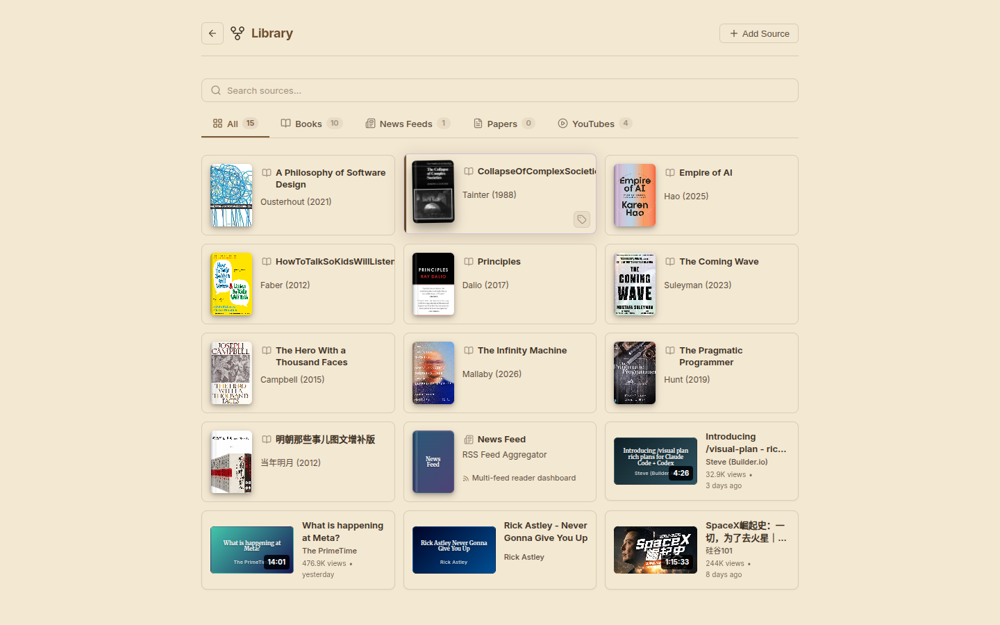

# pi-tree

[](https://github.com/shuowu/pi-tree/actions/workflows/ci.yml)
[](https://github.com/shuowu/pi-tree/blob/master/LICENSE)
[](https://github.com/shuowu/pi-tree/releases)
[](https://github.com/shuowu/pi-tree/pkgs/container/pi-tree)

**Read books, research papers, news feeds, and YouTube videos with an AI that reads alongside you — entirely on your own machine.**

Pi-tree is a local-first, open-source AI reading companion. Add a source to your library, then explore it through branching conversations: go deep on a concept, follow a tangent, zoom back out. Your reading path is a navigable tree, not a disposable chat log.

> **Local-first, bring your own key.** Runs entirely on your machine. No cloud account, no subscription. Works with cloud APIs (DeepSeek, Gemini, Claude) or fully offline with [Ollama](https://ollama.com) / local models.

<p align="center">
  <a href="https://shuowu.github.io/pi-tree/docs/features">
    
  </a>
  <br />
  <sub><a href="#getting-started">🚀 Quick start</a> · <a href="https://shuowu.github.io/pi-tree/docs/features">📸 See all features</a> · <a href="https://shuowu.github.io/pi-tree/">📖 Documentation</a> · <a href="https://shuowu.github.io/pi-tree/vision">Vision</a> · <a href="CONTRIBUTING.md">Contributing</a></sub>
</p>

## What You Can Read

Pi-tree supports four source types, each handled by a dedicated [plugin](#how-it-works):

📚 **Books** — Upload EPUB, MOBI, PDF, or Markdown. The AI guides you chapter by chapter with reading skills, structural analysis, and branching discussions. Multiple session modes: guided reading, freeform Q&A, or deep analysis.

📰 **News Feeds** — Add RSS/Atom feeds. Pi-tree crawls and deduplicates articles, then lets you scan trends, deep-dive into stories, and discuss the news with AI. Comes with its own dashboard and feed management.

📄 **Research Papers** — Search arXiv directly from the chat. Fetch papers, read them with AI-provided context, and branch into methodology questions or related work.

🎥 **YouTube Videos** — Paste a link. Pi-tree extracts the transcript and video metadata, then lets you discuss the content — quote specific segments, ask follow-ups, compare with other sources. Includes an embedded video player.

> [!IMPORTANT]
> Users are responsible for ensuring they have the right to use any content loaded into pi-tree. This project does not distribute, host, or provide access to any copyrighted material.

## Beyond the Shelf

Reading feeds a knowledge layer that works across all your sources:

✨ **Discover** — Ask *"what should I read next?"* Pi-tree reads your actual reading history — sessions, memos, concepts — and recommends new books (grounded against Open Library), papers (arXiv), and feeds (RSS sites, YouTube channels). Every recommendation carries a reason tied to what *you* read. One click adds it to your library.

🧠 **Memos & Concepts** — Save key takeaways as searchable memos (`/memo`, `/recall`, or let the AI suggest them). Pi-tree also extracts concepts from every source into a cross-source knowledge graph, so ideas link up across books, papers, and videos.

## Getting Started

Pi-tree needs an AI model to read with you — an API key from a cloud provider, or a local model. No key yet? [It takes two minutes](#getting-an-api-key-2-minutes).

### Docker (recommended)

```bash
cp .env.example .env   # edit with your API key

docker run -d --name pi-tree \
  --env-file .env \
  -p 3847:3847 \
  -v ~/.local/share/pi-tree:/data \
  ghcr.io/shuowu/pi-tree:latest
```

Open http://localhost:3847 (serves both frontend and API).

> [!TIP]
> Full setup options → [Self-hosting guide](https://shuowu.github.io/pi-tree/docs/self-hosting#docker)

### From Source

```bash
cp .env.example .env   # edit with your API key and provider
npm install
npm run dev
```

Dev server runs on `:3947`, client on `:5947`. Open http://localhost:5947.

### Desktop App ⚠️ Experimental

Download from the [**Releases page**](https://github.com/shuowu/pi-tree/releases/latest) — available for macOS, Linux, and Windows. No Node.js, no Docker, no terminal needed.

Open the app, enter an API key (or point to a local Ollama server), and start reading.

### Getting an API key (2 minutes)

Pi-tree works great with cheap, fast models — no expensive frontier model required:

1. Create a free account with [DeepSeek](https://platform.deepseek.com/) or [Google AI Studio](https://aistudio.google.com/) (Gemini has a free tier)
2. Generate an API key from the dashboard
3. Paste it into your `.env` file (or the desktop app's Settings page)

Reading an entire book typically costs a few cents with DeepSeek — or nothing at all with a free local model via [Ollama](https://ollama.com/download).

## Why Pi-tree?

**AI makes you productive where you already understand. It confuses you where you don't.** Ask an expert a smart question and AI gives them a brilliant answer; ask a beginner the same question and they get a confident-sounding paragraph they can't evaluate. Most AI tools help you skip past material — paste, summarize, move on — which only works when you already know the domain. Pi-tree works on that boundary: it treats reading as a process worth having, one that expands what you're capable of understanding.

| | Pi-tree | ChatGPT / Claude | NotebookLM | Obsidian + AI |
|---|---|---|---|---|
| **Focus** | Comprehension & exploration | General-purpose Q&A | Document Q&A | Note-taking |
| **Conversations** | 🌳 Tree — branch, explore, return | Linear chat | Linear chat | Linear chat |
| **AI approach** | Agentic — tools & skills over local data | Prompt + context window | RAG over uploads | Plugins over local vault |
| **Sources** | Books, papers, news feeds, YouTube | File uploads, web | Multi-doc notebooks | Markdown vault |
| **Extensibility** | Skills, plugins, MCP bridge | GPTs (cloud-hosted) | None | Community plugins |
| **Model choice** | BYOK — any provider or local | Vendor-locked | Google only | Plugin-dependent |
| **Data** | Local-first, self-hosted | Cloud | Cloud | Local |

### What a session looks like

```
📖 Reading: Thinking, Fast and Slow (Kahneman)

Root
├── What is System 1 vs System 2?
│   ├── How does this relate to cognitive biases?
│   │   └── Anchoring bias deep-dive
│   └── Real-world examples in decision making
├── Chapter 3: The Lazy Controller
│   └── Why do we avoid effortful thinking?
└── Comparison with Nassim Taleb's ideas
    ├── Black Swan connection
    └── Antifragility and heuristics
```

Each node is a conversation branch with full context. Go deep on any concept, then navigate back to explore something else — no context lost.

The tree isn't just a UX choice — each branch sends the model only its own path, not your whole history, so responses stay accurate, cheap, and grounded even hundreds of messages in. [Why trees work better for LLMs →](https://shuowu.github.io/pi-tree/#why-trees-work-better-for-llms)

## Models

Pi-tree doesn't need frontier-class models — reading and comprehension are more about context and conversation than raw reasoning. Smaller, faster models work well and keep costs low (or free with local inference).

| Provider | Model | Notes |
|----------|-------|-------|
| DeepSeek | `deepseek-v4-flash` | Very cheap, strong reading comprehension |
| Google | `gemini-2.5-flash` | Fast, large context window |
| Anthropic | `claude-haiku-4-20250514` | Fast, great quality-to-cost ratio |
| Zhipu | `glm-5-turbo` | Good Chinese + English bilingual support |

**Local models** — completely offline, no API costs. Use [Ollama](https://ollama.com/download) or [LM Studio](https://lmstudio.ai/). Gemma 4 (12B) and Qwen 3.6 are good starting points.

A built-in **usage dashboard** tracks tokens and cost per session, source, and provider — you always know what your reading costs.

> [!TIP]
> Multi-provider setup, runtime switching, compatibility flags → [Models & Providers](https://shuowu.github.io/pi-tree/docs/models)

## How It Works

Built on the [Pi SDK](https://pi.dev/docs/latest/sdk) — a minimalist AI agent framework with tree-structured conversations.

Each source type ships as a self-contained **plugin** with its own tools, skills, session profiles, and (optionally) routes and UI panels — the server discovers and wires them at startup. You can extend pi-tree at three levels, from zero-code to full package: drop a `SKILL.md` file to change how the AI reads, add a YAML profile to create a new source type, or [build a full plugin](https://shuowu.github.io/pi-tree/docs/examples). External [MCP servers](https://modelcontextprotocol.io) plug in with no code changes.

> [!TIP]
> Architecture deep dive, custom skills, plugin development → [Documentation](https://shuowu.github.io/pi-tree/docs/architecture)

## Security & Privacy

Pi-tree is local-first — no cloud accounts, no telemetry, no phone-home. API keys are stored on your filesystem and sent only to your chosen provider.

- 🛡️ **Session-scoped permissions** — Each session type declares in YAML exactly which tools the agent can use. A book reading session gets 5-8 purpose-built tools. No shell. No file editing. No database writes.
- 📡 **Fully offline** — Pair with [Ollama](https://ollama.com) for air-gapped operation. No internet required.
- 📖 **Open source** — AGPL-3.0. Audit the code, fork it, self-host it.

Pi-tree's agent is a **reading companion**, not a general-purpose agent. The permission model reflects that — minimal surface area, scoped by purpose, auditable by design.

## License

This project is licensed under the [GNU Affero General Public License v3.0](LICENSE).
