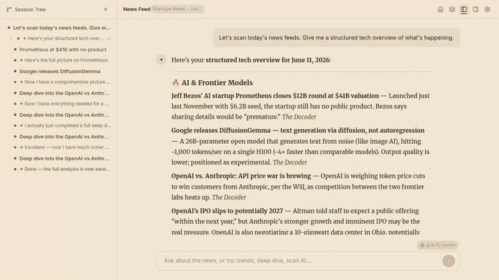

# pi-tree

[](https://github.com/shuowu/pi-tree/actions/workflows/ci.yml)
[](https://github.com/shuowu/pi-tree/blob/master/LICENSE)
[](https://github.com/shuowu/pi-tree/releases)
[](https://ghcr.io/shuowu/pi-tree)

**AI made everyone a faster producer. Nobody's becoming a better reader.**

Pi-tree is for the input side of knowledge work. Load your books, news feeds, or research papers — an AI reads them *with* you, not as a flat Q&A, but as branching conversations that capture how you actually think about the material. Go deep on a concept, branch into a tangent, zoom back out. Your reading path is a navigable tree, not a disposable chat log.

> **Local-first, bring your own key.** Runs entirely on your machine. No cloud account, no subscription. Works with cloud APIs (DeepSeek, Gemini, Claude) or fully offline with [Ollama](https://ollama.com) / local models.

<p align="center">
  <a href="https://shuowu.github.io/pi-tree/">
    
  </a>
  <br />
  <sub><a href="https://shuowu.github.io/pi-tree/">📖 Documentation</a> · <a href="https://shuowu.github.io/pi-tree/vision">Vision</a> · <a href="https://shuowu.github.io/pi-tree/">▶ Watch Demo</a> · <a href="CONTRIBUTING.md">Contributing</a></sub>
</p>

## Why Pi-tree?

Most AI tools treat reading as a problem to skip past — paste the text, get the summary, move on. Pi-tree treats reading as a process worth having.

| | Pi-tree | ChatGPT / Claude | NotebookLM | Obsidian + AI |
|---|---|---|---|---|
| **Focus** | Comprehension & exploration | General-purpose Q&A | Document Q&A | Note-taking |
| **Conversation shape** | 🌳 Tree — branch, explore, return | Linear chat | Linear chat | Linear chat |
| **Persistence** | Long-term reading companion | Session-oriented | Project-scoped | Manual |
| **Model choice** | BYOK — any provider or local | Vendor-locked | Google only | Plugin-dependent |
| **Data ownership** | Local-first, your files | Cloud | Cloud | Local |

### What a session looks like

```
📖 Reading: Thinking, Fast and Slow (Kahneman)

Root
├── What is System 1 vs System 2?
│   ├── How does this relate to cognitive biases?
│   │   └── Anchoring bias deep-dive
│   └── Real-world examples in decision making
├── Chapter 3: The Lazy Controller
│   └── Why do we avoid effortful thinking?
└── Comparison with Nassim Taleb's ideas
    ├── Black Swan connection
    └── Antifragility and heuristics
```

Each node is a conversation branch with full context. Go deep on any concept, then navigate back to explore something else — no context lost.

### Why trees work better for LLMs

The tree structure isn't just a UX choice — it makes the AI better.

In a linear chat, every message you've ever sent is packed into the context window. After 30 turns spanning three different topics, the model is trying to track everything at once — and starts hallucinating, losing the thread, or ignoring your latest question in favor of something from 20 messages ago.

Trees fix this at the architecture level:

- **Focused context** — Each branch carries only its path from root to current node. When you're exploring cognitive biases, the model doesn't see your earlier tangent about Nassim Taleb. Less noise → more accurate responses.
- **Token savings** — A 50-message linear chat sends all 50 messages every turn. A tree with 5 branches of 10 messages sends only ~10. Fewer tokens per request → lower cost, faster responses.
- **Less hallucination** — Context pollution is a primary cause of hallucination in long conversations. Isolated branches mean the model stays grounded in the relevant thread.
- **Longer effective conversations** — Linear chats degrade in quality well before hitting the context window limit. Trees keep each branch short and focused, so you can explore a source across hundreds of messages without quality loss.

## What You Can Read

Pi-tree supports four source types, each handled by a dedicated [plugin](#plugin-architecture):

📚 **Books** — Upload EPUB, MOBI, or PDF. The AI guides you chapter by chapter with reading skills, structural analysis, and branching discussions. Multiple session modes: guided reading, freeform Q&A, or deep analysis.

📰 **News Feeds** — Add RSS/Atom feeds. Pi-tree crawls and deduplicates articles, then lets you scan trends, deep-dive into stories, and discuss the news with AI. Comes with its own dashboard and feed management.

📄 **Research Papers** — Search arXiv directly from the chat. Fetch papers, read them with AI-provided context, and branch into methodology questions or related work.

🎥 **YouTube Videos** — Paste a link. Pi-tree extracts the transcript and video metadata, then lets you discuss the content — quote specific segments, ask follow-ups, compare with other sources. Includes an embedded video player.

> [!IMPORTANT]
> Users are responsible for ensuring they have the right to use any content loaded into pi-tree. This project does not distribute, host, or provide access to any copyrighted material.

## Who Is This For?

- 📚 **Serious nonfiction readers** — turn passive reading into active conversation
- 🎓 **Researchers & graduate students** — work through papers with persistent context
- 📰 **News followers** — RSS feeds become conversational sources, not scroll fodder
- 🧠 **PKM enthusiasts** — tree-structured conversations as a knowledge building primitive
- 🔧 **Developers** — explore codebases conversationally with [custom plugins](https://shuowu.github.io/pi-tree/docs/examples)

## Getting Started

### Desktop App (easiest)

Download from the [**Releases page**](https://github.com/shuowu/pi-tree/releases/latest) — available for macOS, Linux, and Windows. No Node.js, no Docker, no terminal needed.

Open the app, enter an API key (or point to a local Ollama server), and start reading.

### Docker

```bash
cp .env.example .env   # edit with your API key

docker run -d --name pi-tree \
  --env-file .env \
  -p 3847:3847 \
  -v pi-tree-data:/data \
  ghcr.io/shuowu/pi-tree:latest
```

Open http://localhost:3847 (serves both frontend and API).

> [!TIP]
> Full setup options → [Docker guide](https://shuowu.github.io/pi-tree/docs/docker)

### From Source

```bash
cp .env.example .env   # edit with your API key and provider
npm install
npm run dev
```

Dev server runs on `:3947`, client on `:5947`. Open http://localhost:5947.

## Models

Pi-tree doesn't need frontier-class models — reading and comprehension are more about context and conversation than raw reasoning. Smaller, faster models work well and keep costs low (or free with local inference).

| Provider | Model | Notes |
|----------|-------|-------|
| DeepSeek | `deepseek-v4-flash` | Very cheap, strong reading comprehension |
| Google | `gemini-2.5-flash` | Fast, large context window |
| Anthropic | `claude-haiku-4-20250514` | Fast, great quality-to-cost ratio |
| Zhipu | `glm-5-turbo` | Good Chinese + English bilingual support |

**Local models** — completely offline, no API costs. Use [Ollama](https://ollama.com/download) or [LM Studio](https://lmstudio.ai/). Gemma 4 (12B) and Qwen 3.6 are good starting points.

> [!TIP]
> Multi-provider setup, runtime switching, compatibility flags → [Models & Providers](https://shuowu.github.io/pi-tree/docs/models)

## How It Works

Built on the [Pi SDK](https://pi.dev/docs/latest/sdk) — a minimalist AI agent framework with tree-structured conversations.

### Plugin architecture

Each source type ships as a self-contained **plugin** — an independent package with its own tools, skills, session profiles, and (optionally) HTTP routes and UI components. The server discovers plugins at startup and wires their capabilities into the right sessions.

| Plugin | Source Type | What it provides |
|--------|------------|-----------------|
| `plugin-book` | Books | EPUB/MOBI/PDF parsing, guided reading, analysis, outline generation |
| `plugin-news` | News | RSS crawling, feed management, news discussion (own database) |
| `plugin-paper` | Papers | arXiv search, paper fetching, research reading |
| `plugin-youtube` | YouTube | Transcript extraction, video info, embedded player |
| `plugin-mcp` | — | Bridges external [MCP servers](https://modelcontextprotocol.io) (web search, etc.) |

Plugins depend only on `@pi-tree/plugin-sdk` — they can't access server internals. Each plugin declares a manifest in `package.json` that tells the server what source type it handles, which tools and skills it provides, and what routes to mount. Adding a new source type means adding a new plugin package, not modifying the server.

### Skills shape behavior

The AI doesn't have hardcoded reading logic. Behavior is driven by **skill files** — markdown instructions bundled in plugins that tell the AI how to interact with each source type. Change a `SKILL.md`, change the behavior. Add custom skills to `$DATA_PATH/skills/` without touching code.

### Other key choices

- **Session profiles** — declarative YAML files map each `(sourceType, mode)` to specific skills and tools. Audit them, override them, [create your own](https://shuowu.github.io/pi-tree/docs/self-hosting#custom-session-profiles)
- **Data separation** — Pi SDK owns conversation content (JSONL files); pi-tree owns metadata (SQLite: users, sessions, config, glossary)
- **Multi-user** — each user gets isolated sessions, config, and glossary per source

> [!TIP]
> Architecture deep dive, custom skills, plugin development → [Documentation](https://shuowu.github.io/pi-tree/docs/architecture)

## Security & Privacy

Pi-tree is local-first — no cloud accounts, no telemetry, no phone-home. API keys are stored on your filesystem and sent only to your chosen provider.

- 🛡️ **Session-scoped permissions** — Each session type declares exactly which tools the agent can use. A book reading session gets 5-8 purpose-built tools. No shell. No file editing. No database writes.
- 📝 **Declarative profiles** — Capabilities are configured in YAML. `exclude_tools: [bash, edit]` is the default for all user-facing sessions. Audit them, override them, create your own.
- 📡 **Fully offline** — Pair with [Ollama](https://ollama.com) for air-gapped operation. No internet required.
- 📖 **Open source** — AGPL-3.0. Audit the code, fork it, self-host it.

Pi-tree's agent is a **reading companion**, not a general-purpose agent. The permission model reflects that — minimal surface area, scoped by purpose, auditable by design.

## Design Philosophy

More on why pi-tree exists → [Vision](https://shuowu.github.io/pi-tree/vision)

The short version: the AI industry is focused on **output** — helping you produce things faster. Pi-tree is focused on **input** — helping you understand things deeper. Every design decision (tree-structured conversations, persistent context, branching exploration, per-source glossaries) serves that single purpose: making information ingestion a richer experience, not a faster one.

## License

This project is licensed under the [GNU Affero General Public License v3.0](LICENSE).
