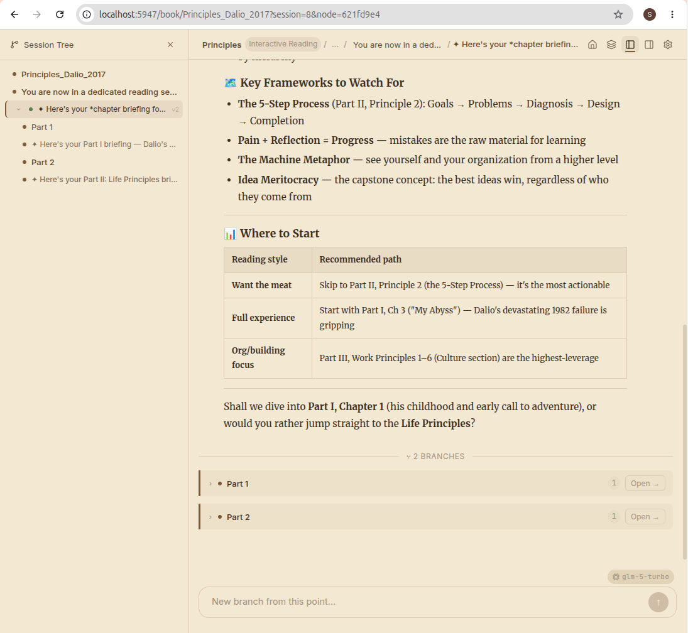

# pi-tree

**Turn any book into a conversation you can explore like a tree.**

You load your own books. An AI reads them *with* you — not as a flat Q&A, but as a branching conversation that captures how you actually think about the material. Go deep on a concept, branch into a tangent, zoom back out. Your reading path is a navigable tree, not a disposable chat log.

> **Local-first, bring your own key.** Runs entirely on your machine. No cloud account, no subscription. Works with cloud APIs (DeepSeek, Gemini, Claude) or fully offline with [Ollama](https://ollama.com) / local models.

<table align="center">
  <tr>
    <td align="center">
      
      <br />
      <sub>Browse your library — upload EPUBs, MOBIs, or PDFs</sub>
    </td>
    <td align="center">
      
      <br />
      <sub>Branching conversation with topic tree navigation</sub>
    </td>
  </tr>
</table>

## The Problem

Most AI tools treat books the same way they treat any prompt: paste text in, get a summary out, conversation gone. There's no structure, no persistence, no sense of *journey* through the material.

Reading a non-fiction book isn't linear. You branch — *"wait, how does this connect to X?"* — then come back. You re-read a section with new context. You accumulate a personal vocabulary of terms and ideas. Flat chat threads can't capture any of this.

**Pi-books fixes this.** Each book gets a tree-structured conversation where:

- **Branches happen on semantic shifts** — go deeper, switch chapters, follow a tangent — each gets its own branch with full context preserved
- **You can zoom in and out** — dive deep on a concept, then pull back with a summary without losing your place
- **Every user gets their own tree** — multiple people can read the same book independently, each with their own conversation, glossary, and reading history
- **The conversation IS the reading** — no separate "reader" and "chat." The AI surfaces book content as quotes within the conversation
- **Everything stays local** — your books, sessions, questions, and intellectual journey never leave your machine

## Who Is This For

- **Non-fiction readers** who want more than highlights and summaries — you want to *think through* a book
- **Families and book clubs** — everyone gets their own conversation tree for the same book
- **Privacy-conscious readers** who don't want their reading habits on someone else's server
- **Self-hosters and tinkerers** who want full control over their tools

## Getting Started

### Prerequisites

[Node.js](https://nodejs.org/) 22+, npm.

### Local setup (no Docker)

```bash
cp .env.example .env   # edit with your API key and provider
npm install
npm run dev
```

Dev server runs on `:3947`, client on `:5947`. Open http://localhost:5947.

### Docker

Pre-built images are published to GitHub Container Registry on every release (linux/amd64 + linux/arm64):

```bash
docker pull ghcr.io/shuowu/pi-tree:latest
```

**Quick start with the pre-built image:**

```bash
cp .env.example .env   # edit with your API key and paths

docker run -d --name pi-tree \
  --env-file .env \
  -p 3847:3847 \
  -v /path/to/your/books:/library:ro \
  -v pi-tree-data:/data \
  ghcr.io/shuowu/pi-tree:latest
```

**Or build from source:**

```bash
cp .env.example .env   # edit with your API key and ABSOLUTE paths
docker compose up --build
```

Open http://localhost:3847 (serves both frontend and API).

*Full env vars, volumes, custom skills → [docs/SELF-HOSTING.md](docs/SELF-HOSTING.md)*

## Models

Pi-books doesn't need frontier-class models — book reading is more about context and conversation than raw reasoning. Smaller, faster models work well and keep costs low (or free with local inference).

**Cloud APIs** (cheapest options that work well):

| Provider | Model | Notes |
|----------|-------|-------|
| DeepSeek | `deepseek-v4-flash` | Very cheap, strong reading comprehension |
| Google | `gemini-2.5-flash` | Fast, large context window |
| Anthropic | `claude-haiku-4-20250514` | Fast, great quality-to-cost ratio |
| Zhipu | `glm-5-turbo` | Good Chinese + English bilingual support |

**Local models** — completely offline, no API costs. Use [Ollama](https://ollama.com/download) or [LM Studio](https://lmstudio.ai/) to run models locally. Gemma 4 (12B, 256K context) and Qwen 3.6 are good starting points — explore what works for your hardware and reading language.

Point pi-tree at your local server in `.env`:

```bash
PI_PROVIDER=openai                              # Ollama/LM Studio expose an OpenAI-compatible API
PI_API_KEY=not-needed
PI_BASE_URL=http://localhost:11434/v1            # Ollama default (LM Studio: http://localhost:1234/v1)
PI_MODEL=gemma4:12b
```

**Multiple providers** — for advanced setups (e.g., Ollama for offline + DeepSeek for cloud), use Pi's native [`models.json`](https://pi.dev/docs/latest/models) config at `~/.pi/agent/models.json`. Env vars and `models.json` merge automatically — you can use both.

> [!TIP]
> You can also change models at runtime through the Settings UI — no restart needed.

## Book Content

Pi-books is a **reading tool** — no book content is included in this repository.

You can add books in two ways:
1. **Upload** via the Library UI (supports EPUB, MOBI, PDF)
2. **Local folder** — set `LIBRARY_PATH` in `.env` to point at your book collection

> [!IMPORTANT]
> Users are responsible for ensuring they have the right to use any content loaded into pi-tree. This project does not distribute, host, or provide access to any copyrighted material.

## How It Works

Built on the [Pi SDK](https://pi.dev/docs/latest/sdk) — a minimalist AI agent with tree-structured conversations. The same `extension` package powers both the GUI and the [Pi terminal](https://pi.dev).

```
packages/
  shared/      — TypeScript types shared between client and server
  extension/   — Pi Package: skills, ebook parsers, Pi extensions (publishable)
  server/      — Hono API server wrapping Pi SDK + tree manager
  client/      — React + Vite frontend
```

Key architectural choices:
- **Server is thin** — receives a message, passes it to a Pi SDK session with book context, streams the response back via SSE
- **Skills shape behavior** — 11 built-in reading skills (markdown instruction files) control how the AI reads. Change a SKILL.md, change the behavior — no code changes needed
- **Data separation** — Pi SDK owns conversation content (JSONL files); pi-tree owns metadata (SQLite: users, sessions, config, glossary)

*Architecture deep dive → [docs/ARCHITECTURE.md](docs/ARCHITECTURE.md)*

## Extensions

Pi-books supports custom **skills** and **extensions**. Since it's built on [Pi](https://pi.dev), any Pi-compatible extension works here. One worth adding:

```bash
pi install npm:pi-web-search    # gives the AI web search during reading sessions
```

This lets the AI look up references, author background, or related concepts while you read — without leaving the conversation.

> [!NOTE]
> Extension documentation is a work in progress. See [docs/SELF-HOSTING.md](docs/SELF-HOSTING.md) for the current skill and extension format.

## Design Philosophy

More on why pi-tree exists and the design decisions behind it → [docs/VISION.md](docs/VISION.md)

The short version: general-purpose AI chatbots can summarize a book, but they do it in a flat, sessionless way. Pi-books is a **reading companion** — every design decision (tree structure, branching conversations, zoom controls, per-book glossaries) serves that single purpose.

## License

This project is licensed under the [GNU Affero General Public License v3.0](LICENSE).
