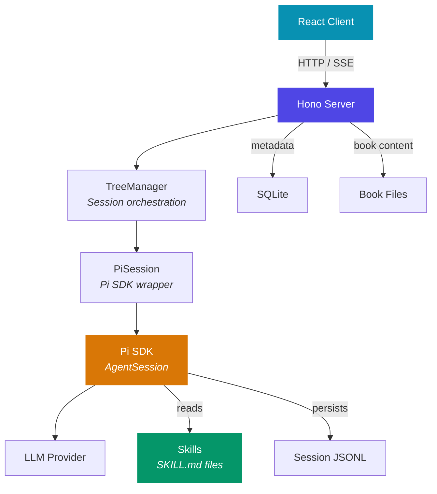
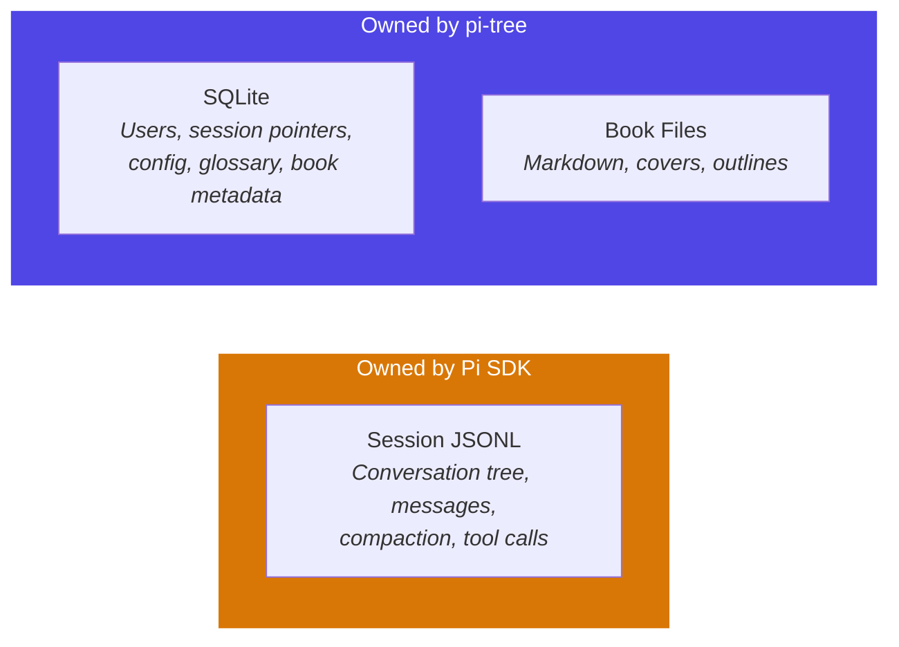

# Architecture

Pi-books is a web app built around the Pi SDK. The server doesn't implement AI logic — it delegates to Pi SDK sessions and shapes behavior through skills.

## How It Works



**The server's role is thin**: receive a user message, pass it to a Pi SDK session (with book context prepended), and stream the response back as SSE events. The Pi SDK owns the conversation tree, compaction, tool execution, and session persistence.

**Skills shape behavior**: The AI doesn't have hardcoded reading logic. Skills like `interactive-reading`, `book-analysis`, and `deep-dive` are injected by the Pi SDK's resource loader. Changing a SKILL.md changes how the AI reads — no server code changes needed.

## Data Separation



| What | Where | Owner |
|------|-------|-------|
| Conversation content (messages, tree, compaction) | `sessions/<bookId>/<userId>/*.jsonl` | Pi SDK |
| User identity, session pointers, config | `pi-tree.db` (SQLite) | pi-tree |
| Book content (markdown, outlines, covers) | `library/` or `books/` | pi-tree |
| Reading skills and extensions | `packages/extension/` + user paths | Pi SDK resource loader |

The key insight: **pi-tree never reads or writes session JSONL directly**. It tells the Pi SDK "start session from this file" and "send this message" — the SDK manages the rest. SQLite only stores metadata that the SDK doesn't care about (which user, which book, UI config, glossary terms).

## Extension Package

`packages/extension` is a publishable Pi Package containing skills, parsers, and tools:

```
packages/extension/
├── skills/              → Discovered by Pi SDK via additionalSkillPaths
├── extensions/          → Pi terminal tools (ebook_convert, etc.)
└── src/parsers/         → Library code imported by server for book uploads
```

Same code, two consumers: the web app imports parsers as a library, the Pi terminal loads skills and extensions natively via `pi install`.
