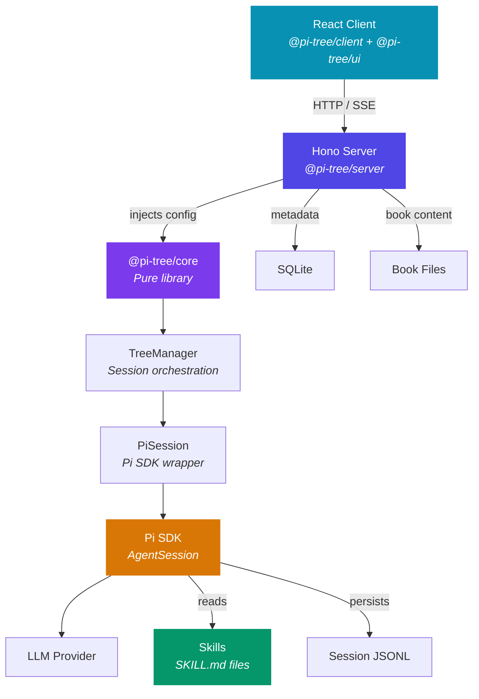
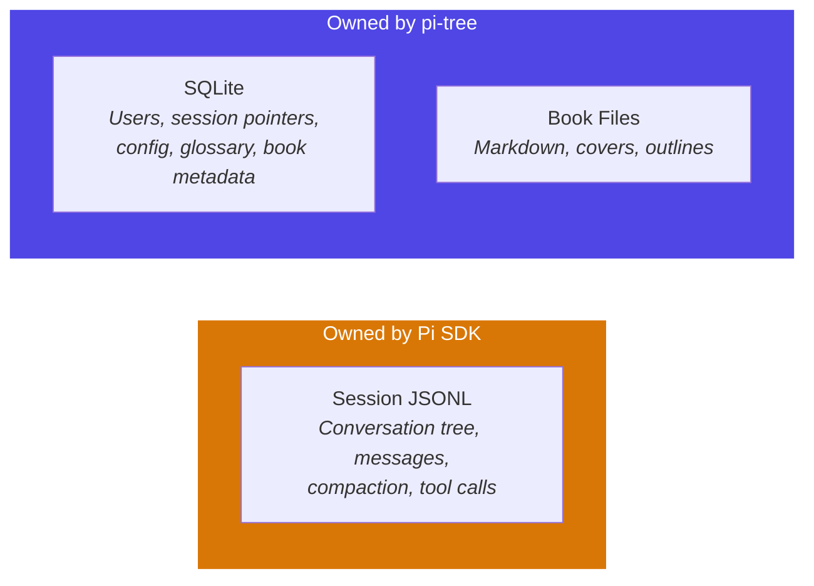

# Architecture

Pi-tree is a web app built around the Pi SDK. AI orchestration logic lives in `@pi-tree/core` (a pure library); the server is a thin app layer that resolves configuration and delegates to core.

## How It Works



**Core (`@pi-tree/core`) owns AI logic**: PiSession wraps the Pi SDK, TreeManager orchestrates sessions, and `configureModelRegistry()` handles provider/model setup. Core is a pure library — no `process.env`, no file I/O. All configuration is injected via `PiSessionConfig`.

**Server (`@pi-tree/server`) is the app layer**: It resolves environment variables, manages the database, serves HTTP routes, and injects config into core.

**Skills shape behavior**: The AI doesn't have hardcoded reading logic. Three core skills ship with the repo — `interactive-reading`, `book-outline`, and `book-analysis` — and are injected by the Pi SDK's resource loader. Users add custom skills via `$DATA_PATH/skills/` (or `$SKILLS_PATH`); user skills load first (SDK first-wins dedup) so they can override core skills. Changing a SKILL.md changes how the AI reads — no server code changes needed.

## Data Separation



| What | Where | Owner |
|------|-------|-------|
| Conversation content (messages, tree, compaction) | `sessions/<bookId>/<userId>/*.jsonl` | Pi SDK |
| User identity, session pointers, config | `pi-tree.db` (SQLite) | pi-tree |
| Book content (markdown, outlines, covers) | `library/` or `books/` | pi-tree |
| Core skills (3) | `packages/server/skills/` | Pi SDK resource loader |
| User skills (overrides) | `$DATA_PATH/skills/` or `$SKILLS_PATH` | Pi SDK resource loader |

The key insight: **pi-tree never reads or writes session JSONL directly**. It tells the Pi SDK "start session from this file" and "send this message" — the SDK manages the rest. SQLite only stores metadata that the SDK doesn't care about (which user, which book, UI config, glossary terms).

## Server Package (Skills & Parsers)

The core skills and ebook parsers live inside `packages/server`:

```
packages/server/
├── skills/              → Discovered by Pi SDK via additionalSkillPaths
└── src/parsers/         → Ebook parsers used by server for book uploads
```
