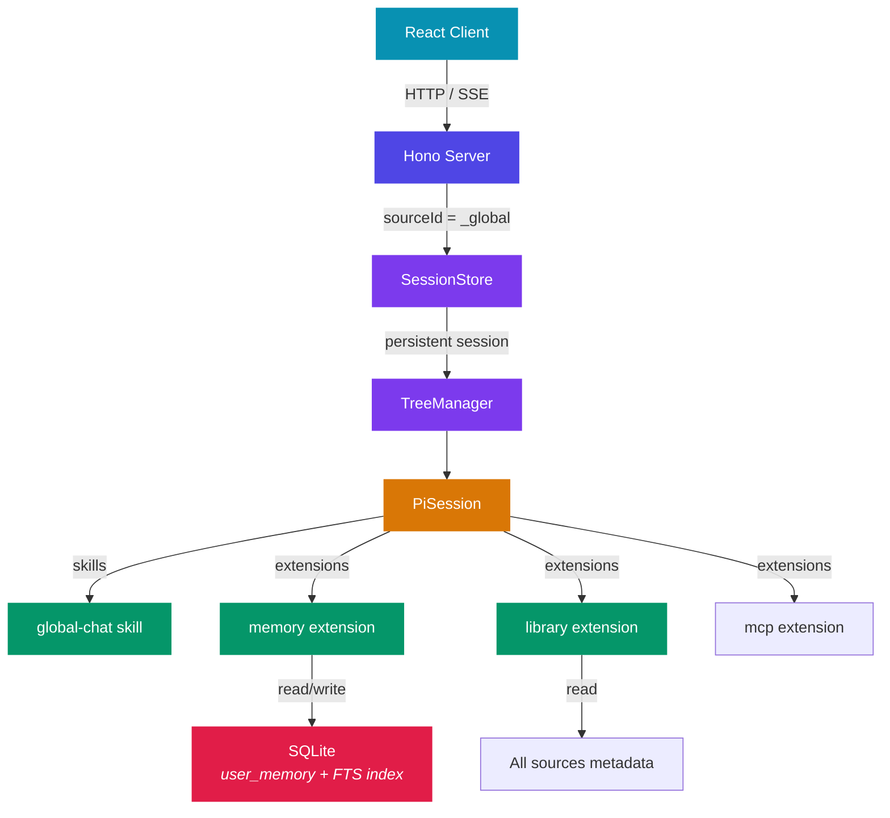
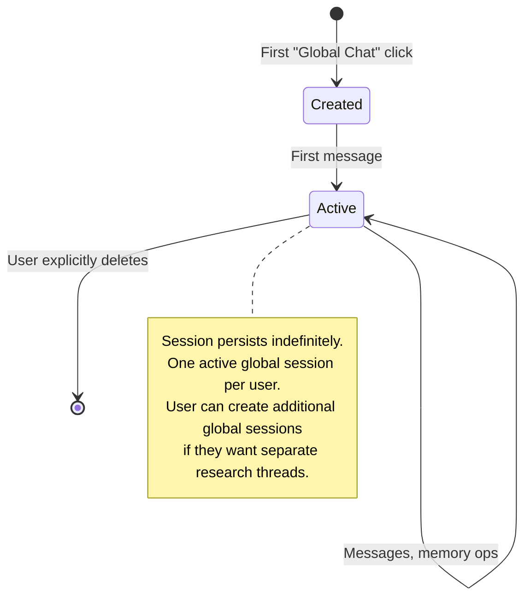

# Global Chat

A cross-source conversation layer — the user's personal research assistant that spans all sources and sessions.

## The Problem

Today, every pi-tree session is an island. You can have deep, branching conversations about Book A and Book B, but there's no place to ask *"what connects these two books?"* or *"summarize everything I've been reading about X."* The AI forgets you the moment you switch sources.

The router session comes close — it can list sources and open sessions — but it's ephemeral (resets every page visit) and can't see into your conversation history.

## What Global Chat Is

A **persistent, cross-source session** where the AI knows your reading history and can reason across all your sources. It's the one session that isn't scoped to a single source.

```
User ──┬── Book A ──── Sessions (scoped to Book A)
       ├── Book B ──── Sessions (scoped to Book B)
       ├── News   ──── Sessions (scoped to News)
       │
       └── Global Chat ──── One persistent session
                             Can search across all of the above
                             Remembers your preferences and interests
```

**Examples of what it enables:**

- *"What themes connect the three books I've been reading?"*
- *"I remember reading something about feedback loops — where was that?"*
- *"Based on my reading history, what should I read next?"*
- *"Summarize my key takeaways from last month"*
- *"Remember that I prefer brief, structured responses"*

## Design Principles

### 1. Tool-based, not injection-based

The global chat agent accesses cross-source data **via tools** (Pi SDK extensions), not by having everything pre-stuffed into its context window. This avoids context pollution and gives the user visibility into when the agent is looking something up.

The agent decides when to search, what to recall, and what to save — the user sees tool calls in the chat, just like any other extension.

### 2. Additive, not invasive

Regular reading sessions remain untouched. The global layer is a separate space — it doesn't inject memories into book sessions by default. This keeps reading sessions clean and avoids the confirmation bias problem where old context colors fresh reading.

### 3. Memory as opt-in, transparent, editable

The user can see what the agent has remembered, edit it, and delete it. No hidden state that silently biases responses. "Forget what I said about X" is a first-class operation.

### 4. Start simple, layer on

Phase 1 is SQLite FTS5 + simple key-value memory. No vector DB, no graph DB, no embedding pipeline. These can be added later if the simple approach hits a wall, but for per-user data volumes (dozens of sources, hundreds of sessions), they're likely unnecessary.

## Architecture

### How It Fits



### Reusing Existing Patterns

Global chat is modeled exactly like the router session, with two key differences:

| | Router | Global Chat |
|---|---|---|
| Source ID | `home-router` | `_global` |
| Source type | `router` | `global` |
| Lifecycle | Ephemeral (fresh each visit) | Persistent (one per user) |
| Extensions | `library`, `news` | `library`, `memory`, `mcp` |
| Skills | `session-router` | `global-chat` |
| Cross-source access | List sources, open sessions | Search session content, manage memory |

This means:

- **SessionStore** works as-is — key is `userId:_global:sessionId`
- **TreeManager** works as-is — it just gets `sourceId = "_global"`
- **Profile resolution** works as-is — new `global.yml` profile
- **Session routes** work as-is — same `/api/session/*` endpoints
- **PiSession** needs a `global` source type case in `getSourceContext()` for the system prompt

### New Components

```
packages/server/
├── src/
│   ├── agents/
│   │   ├── skills/
│   │   │   └── global-chat/           ← NEW: skill instructions
│   │   │       └── SKILL.md
│   │   └── extensions/
│   │       └── memory/                ← NEW: memory tools
│   │           ├── index.ts
│   │           └── tools/
│   │               ├── get-core-memory.ts
│   │               ├── update-core-memory.ts
│   │               ├── search-sessions.ts
│   │               ├── save-insight.ts
│   │               ├── search-insights.ts
│   │               └── forget.ts
│   ├── profiles/
│   │   └── global.yml                 ← NEW: session profile
│   ├── db/
│   │   └── schema.ts                  ← MODIFIED: new tables
│   └── routes/
│       └── global.ts                  ← NEW: global session routes
│
packages/client/
└── src/
    └── pages/
        └── (Library page)             ← MODIFIED: global chat entry point
```

## Data Model

### New Tables

All global chat data lives in SQLite — no filesystem state beyond what Pi SDK owns (JSONL session files). This means everything is queryable via Drizzle ORM and exposed through API routes.

```sql
-- Core memory: always-available user context
-- Small, curated, agent-editable
CREATE TABLE user_memory (
  id          INTEGER PRIMARY KEY AUTOINCREMENT,
  user_id     TEXT NOT NULL REFERENCES users(id),
  key         TEXT NOT NULL,        -- e.g. "preferences", "interests", "reading_goals"
  value       TEXT NOT NULL,        -- JSON or plain text
  created_at  TEXT NOT NULL,
  updated_at  TEXT NOT NULL,
  UNIQUE(user_id, key)
);

-- Archived insights: curated cross-source knowledge
-- Grows over time, searchable
CREATE TABLE user_insights (
  id          INTEGER PRIMARY KEY AUTOINCREMENT,
  user_id     TEXT NOT NULL REFERENCES users(id),
  content     TEXT NOT NULL,        -- the insight text
  source_ids  TEXT,                 -- JSON array of related source IDs
  tags        TEXT,                 -- JSON array of tags
  created_at  TEXT NOT NULL
);

-- Session messages: structured conversation log
-- Pi SDK owns the JSONL files; this table is pi-tree's own
-- structured mirror, written inline at message time.
CREATE TABLE session_messages (
  id          INTEGER PRIMARY KEY AUTOINCREMENT,
  user_id     TEXT NOT NULL REFERENCES users(id),
  source_id   TEXT NOT NULL,
  session_id  INTEGER NOT NULL REFERENCES user_sessions(id),
  role        TEXT NOT NULL,        -- 'user' | 'assistant'
  content     TEXT NOT NULL,        -- message text (tool calls stripped)
  node_id     TEXT,                 -- topic tree node ID, for linking back
  created_at  TEXT NOT NULL
);
CREATE INDEX sm_user_source_idx ON session_messages(user_id, source_id);
CREATE INDEX sm_session_idx ON session_messages(session_id);

-- FTS5 content table backed by session_messages
-- Enables full-text search without duplicating storage
CREATE VIRTUAL TABLE session_messages_fts USING fts5(
  content,
  content='session_messages',
  content_rowid='id',
  tokenize='porter'
);

-- Triggers to keep FTS in sync with session_messages
CREATE TRIGGER sm_fts_insert AFTER INSERT ON session_messages BEGIN
  INSERT INTO session_messages_fts(rowid, content) VALUES (new.id, new.content);
END;
CREATE TRIGGER sm_fts_delete AFTER DELETE ON session_messages BEGIN
  INSERT INTO session_messages_fts(session_messages_fts, rowid, content)
    VALUES('delete', old.id, old.content);
END;
```

### Data Ownership

| Data | Storage | Owner | Access |
|------|---------|-------|--------|
| Conversation tree, compaction, tool calls | JSONL files | Pi SDK | Pi SDK only |
| Structured message log | `session_messages` table | pi-tree | DB / API |
| User preferences, interests | `user_memory` table | pi-tree | DB / API |
| Curated insights | `user_insights` table | pi-tree | DB / API |
| Full-text search index | `session_messages_fts` | pi-tree | DB (via FTS5 queries) |

Pi SDK continues to own the JSONL session files (conversation tree, compaction, branching). The `session_messages` table is pi-tree's **own structured copy** of the message content, written at message time from the stream — never by parsing JSONL. This is intentional duplication: pi-tree needs queryable access to message content, but never touches Pi SDK's internal format.

### Memory Tiers

Inspired by Letta's tiered model, adapted for simplicity:

```
┌───────────────────────────────────────────────────┐
│  CORE MEMORY (user_memory table)                  │
│  • Always injected into global chat system prompt  │
│  • Small: ~5-10 key-value pairs per user          │
│  • Agent-editable via update_core_memory()        │
│  • Examples:                                      │
│    preferences → "prefers structured, brief"      │
│    interests → "systems thinking, economics"      │
│    reading_goals → "understand mental models"     │
├───────────────────────────────────────────────────┤
│  SESSION RECALL (session_content_fts)             │
│  • Full-text search across all user sessions      │
│  • Read-only from agent's perspective             │
│  • Populated by indexer, not by agent             │
│  • Agent queries via search_sessions(query)       │
├───────────────────────────────────────────────────┤
│  INSIGHTS (user_insights table)                   │
│  • Curated cross-source knowledge                 │
│  • Agent writes via save_insight()                │
│  • Agent reads via search_insights(query)         │
│  • User can view/edit/delete via UI               │
│  • Examples:                                      │
│    "Both Dalio and Taleb argue that systems..."   │
│    "Key framework from Book A: ..."               │
└───────────────────────────────────────────────────┘
```

## Memory Extension — Tool Design

### Tools

| Tool | Description | Reads/Writes |
|------|-------------|:---:|
| `get_core_memory` | Returns all core memory entries for the current user | Read |
| `update_core_memory` | Upsert a key-value pair in core memory | Write |
| `search_sessions` | Full-text search across all user's session conversations | Read |
| `save_insight` | Store a curated insight with optional source links and tags | Write |
| `search_insights` | Search archived insights by text or tags | Read |
| `forget` | Delete a specific memory or insight by ID | Write |

### Tool Signatures

```typescript
// get_core_memory — no args, returns all entries for current user
// → { entries: [{ key: "preferences", value: "..." }, ...] }

// update_core_memory
{ key: string, value: string }
// → { success: true }

// search_sessions
{ query: string, source_id?: string, limit?: number }
// → { results: [{ source_title, session_title, role, content, date }] }

// save_insight
{ content: string, source_ids?: string[], tags?: string[] }
// → { id: number }

// search_insights
{ query?: string, tags?: string[], limit?: number }
// → { insights: [{ id, content, source_ids, tags, created_at }] }

// forget
{ type: "memory" | "insight", id: string | number }
// → { success: true }
```

### Context Injection

Core memory is injected into the global chat system prompt, not retrieved via tool call. This keeps it always-available without the agent needing to "remember to remember":

```
You are the user's personal research assistant. You have access to all their
reading sessions and sources.

== User Profile ==
preferences: prefers structured, brief responses
interests: systems thinking, economics, decision-making
reading_goals: build a personal framework for decision-making

== Available Tools ==
- search_sessions: search across all reading conversations
- search_insights: search your archived insights
- save_insight: archive a notable cross-source connection or takeaway
- update_core_memory: update user profile information
- forget: remove a memory or insight
- list_sources: see all sources in the library
- get_source_info: get details about a specific source
```

## Session Profile

```yaml
# packages/server/src/profiles/global.yml
name: global
label: Global Chat
skills: [global-chat]
extensions: [library, memory, mcp]
exclude_tools: [bash, edit]
```

## Global Source & Session Lifecycle

### Source

A synthetic system source, similar to the router:

```typescript
// Created on first global chat access, not at startup
{
  id: "_global",
  type: "global",
  title: "Global Chat",
  author: "System",
  source: "system",
  status: "ready",
  metadata: JSON.stringify({ description: "Cross-source research assistant" }),
}
```

### Session Lifecycle

Unlike the router (ephemeral), global chat sessions are **persistent**:



### Route Design

Mounted at `/api/global`:

| Method | Path | Description |
|--------|------|-------------|
| `GET` | `/api/global/session/:userId` | Get or create global session |

This endpoint:
1. Ensures the `_global` source exists (upsert)
2. Finds the user's active global session, or creates one
3. Returns `{ sessionId, sourceId: "_global" }`

After this, the client uses the standard `/api/session/*` endpoints with `sourceId: "_global"` — no new interaction routes needed.

## Message Recording

Messages are written to `session_messages` inline — as each conversation turn completes, the server inserts rows for the user message and assistant response. The FTS5 index is kept in sync automatically via SQLite triggers.

```typescript
// In session route, after stream completes:
await recordMessages(db, {
  userId, sourceId, sessionId, nodeId,
  messages: [
    { role: 'user', content: userMessage },
    { role: 'assistant', content: assistantResponse },
  ],
});
```

This is a simple INSERT — no background jobs, no JSONL parsing, no file scanning.

### What Gets Recorded

| Field | Value |
|-------|-------|
| `user_id` | Current user |
| `source_id` | Source this session belongs to |
| `session_id` | Session ID (FK to `user_sessions`) |
| `role` | `user` or `assistant` |
| `content` | Message text (tool calls stripped) |
| `node_id` | Topic tree node, for navigation links |
| `created_at` | Timestamp |

### What Doesn't Get Recorded

- Tool call details (noisy, internal)
- Compaction summaries (Pi SDK internal)
- Router sessions (ephemeral, not useful)
- Global chat sessions themselves (avoid recursive search)

### API Access

Because messages are in SQLite, they're directly queryable via API:

| Method | Path | Description |
|--------|------|-------------|
| `GET` | `/api/messages/:userId` | Recent messages across all sources |
| `GET` | `/api/messages/:userId/:sourceId` | Messages for a specific source |
| `GET` | `/api/messages/:userId/search?q=` | Full-text search via FTS5 |

## Client Integration

### Entry Point

A "Global Chat" button/card on the Library page, positioned prominently alongside the source grid. Not buried in a menu — this is a primary navigation target.

### Reading Experience

Reuses `ChatView` from `@pi-tree/ui` — same chat interface as reading sessions. The difference is in the skill instructions and available tools, not the UI.

### URL

```
/global?session=<id>&node=<nodeId>
```

Or, if keeping consistent with the source-based pattern:

```
/source/_global?session=<id>&node=<nodeId>
```

### Memory Management UI (Phase 2)

A panel or page where users can view, edit, and delete their memories and insights:

- **Core Memory** — editable key-value pairs (preferences, interests, goals)
- **Insights** — list with search, tag filtering, source links, delete

This is important for transparency — the user should always be able to see and control what the AI "knows" about them.

## Phases

### Phase 1: Foundation

**Goal:** Working global chat with cross-session search and basic memory.

- [ ] `_global` source type + synthetic source creation
- [ ] `global.yml` profile
- [ ] `global-chat` skill (SKILL.md with instructions)
- [ ] `memory` extension with `get_core_memory`, `update_core_memory`, `search_sessions`
- [ ] `user_memory` table
- [ ] `session_messages` table + FTS5 index + inline recording
- [ ] `/api/global/session/:userId` route
- [ ] Global chat entry point in Library page
- [ ] `global` case in PiSession `getSourceContext()`

**Not included:** insights, forget, memory management UI, batch indexer.

### Phase 2: Insights & Memory Management

**Goal:** Curated knowledge archive + user control.

- [ ] `user_insights` table
- [ ] `save_insight`, `search_insights`, `forget` tools
- [ ] Memory management panel in client
- [ ] Batch backfill: scan existing JSONL files to populate `session_messages` for pre-existing sessions

### Phase 3: Enrichment (if needed)

**Goal:** Better retrieval quality, only if FTS5 proves insufficient.

- [ ] Embedding-based semantic search (local model via ONNX or API)
- [ ] Hybrid retrieval (FTS5 + embeddings + reciprocal rank fusion)
- [ ] Auto-extraction: post-session hook that extracts notable facts
- [ ] Entity tracking: books, authors, topics as linked entities

## Risks & Mitigations

| Risk | Impact | Mitigation |
|------|--------|------------|
| **Context pollution** — memory biases responses | Stale/wrong memories color fresh thinking | Tool-based retrieval (agent decides when to look); user-editable memory; `forget` tool |
| **Stale memory** — user's interests/views evolve | Agent acts on outdated information | Core memory is agent-editable (self-correcting); timestamps on all entries; user can edit/delete |
| **FTS5 misses** — keyword search doesn't find semantic matches | "I read about feedback loops" doesn't match "reinforcing cycles" | Acceptable in Phase 1; Phase 3 adds embeddings if needed |
| **DB growth** — `session_messages` grows with every conversation | Large DB over time | Record only user/assistant content; exclude tool calls, router sessions; periodic archival for old entries |
| **Dual storage** — messages exist in both JSONL and SQLite | Disk usage | Intentional: JSONL is Pi SDK's (tree structure, compaction); SQLite is pi-tree's (queryable). Message text is small relative to JSONL overhead. |

## Relation to Existing Features

| Feature | How Global Chat Relates |
|---------|------------------------|
| **Router** | Global chat replaces the router's "what should I read?" use case with a persistent, memory-aware version. Router remains for ephemeral quick navigation. |
| **Library extension** | Reused directly — `list_sources`, `get_source_info` are available in global chat. |
| **MCP bridge** | Included in global profile — external tools (web search, etc.) available for research. |
| **`cross_source` UserIntent** | The unused type in `shared/types.ts` was a precursor to this. Global chat is the fuller realization of that intent. |
| **Reading sessions** | Unchanged. Global chat is additive. A future Phase 4 could optionally include the `memory` extension in reading profiles so book sessions can recall global insights — but that's explicitly deferred. |
