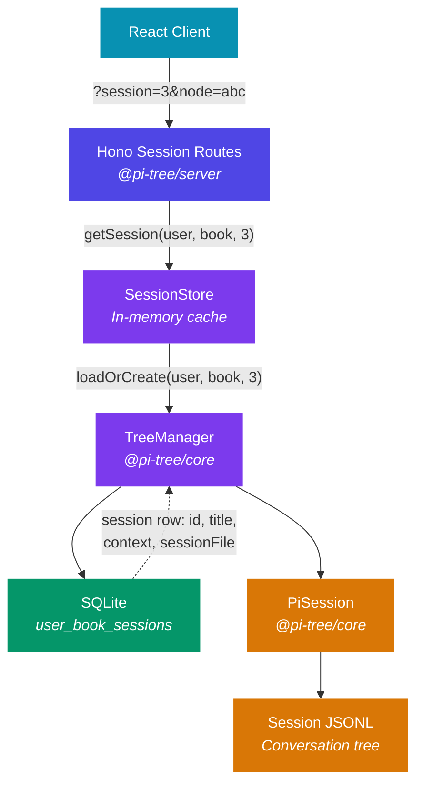
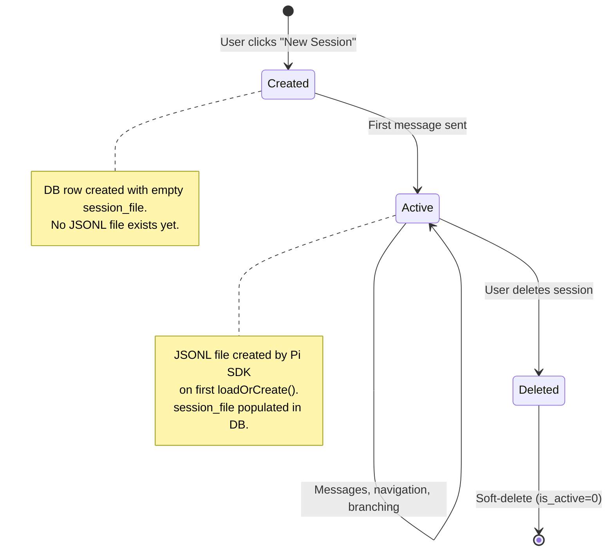

# Session Management

How pi-tree manages reading sessions — the bridge between users, books, and AI agent conversations.

## Core Concept

Each user can have **multiple independent sessions per book**. A session is a complete conversation tree backed by a Pi SDK JSONL file. Different sessions can represent different reading approaches to the same book (guided reading, Q&A, deep dives, etc.).

```
User ──┬── Book A ──┬── Session 1 (Interactive Reading)
       │            ├── Session 2 (Freeform Q&A)
       │            └── Session 3 (Chapter 5 Deep Dive)
       │
       └── Book B ──┬── Session 1 (Interactive Reading)
                    └── Session 2 (Study Group Notes)
```

## Architecture



## Data Model

### Database: `user_book_sessions`

| Column | Type | Description |
|--------|------|-------------|
| `id` | INTEGER PK | Session identifier (auto-increment) |
| `user_id` | TEXT FK | References `users.id` |
| `book_id` | TEXT | Book identifier |
| `title` | TEXT | Human-readable session name |
| `context` | TEXT (JSON) | `SessionContext` blob — session configuration |
| `session_file` | TEXT | Absolute path to Pi SDK JSONL file |
| `is_active` | INTEGER | 1 = active, 0 = soft-deleted |
| `created_at` | TEXT | ISO 8601 timestamp |
| `last_active_at` | TEXT | Updated on each message |

### SessionContext

```typescript
interface SessionContext {
  mode: 'reading' | 'qa' | 'custom';
  systemPrompt?: string;   // Optional prompt override
  skills?: string[];        // Optional skill filter
  model?: string;           // Optional model override
}
```

The `context` column captures the **intent** of the session at creation time. This enables per-session behavior configuration.

**Current state**: All sessions run the same skills/prompt/model regardless of context. The field is stored but not yet wired to affect PiSession behavior.

**Future**: The server will read `context` when creating a PiSession and use it to:
- Filter which skills the ResourceLoader discovers
- Swap system prompts (e.g., Q&A mode gets a different persona)  
- Select a different model (e.g., cheaper model for casual browsing)

## Session Lifecycle



1. **Create**: `POST /api/sessions/:userId/:bookId` → DB row with title + context. No JSONL file yet.
2. **First load**: `TreeManager.loadOrCreate(userId, bookId, sessionId)` → Pi SDK creates the JSONL file → path stored in `session_file`.
3. **Resume**: Subsequent loads find the `session_file` from DB and pass it to `SessionManager.open()`.
4. **Delete**: Soft-delete — sets `is_active = 0`. JSONL files are preserved for potential recovery.

## In-Memory Session Cache

`SessionStore` keeps active `TreeManager` instances in memory to avoid re-creating Pi SDK sessions on every HTTP request.

```
Key: "userId:bookId:sessionId" → TreeManager instance
```

Only one TreeManager exists per unique session. When a session is closed or deleted, it's evicted from the cache.

## Context Binding — How Sessions Connect to AI Behavior

A session's AI behavior is shaped by three layers:

| Layer | What | Currently | With SessionContext (future) |
|-------|------|-----------|------------------------------|
| **Skills** | SKILL.md files discovered by Pi SDK | Global — same for all sessions | Filter by `context.skills` |
| **System prompt** | Deferred context injected on first message | Same template, only bookId varies | Override via `context.systemPrompt` |
| **Model** | LLM provider + model ID | Global server config | Override via `context.model` |

### Current Flow (identical for all sessions)

```
PiSession.create(config)          // @pi-tree/core — config injected by server
  ├── configureModelRegistry()    // Registers providers/models from config
  │
  ├── ResourceLoader discovers ALL skills from:
  │   ├── packages/server/skills/        (built-in)
  │   ├── DATA_PATH/skills/              (user-mounted)
  │   └── DATA_PATH/extensions/          (user-mounted)
  │
  ├── createAgentSession() with:
  │   ├── model: config.readingModel
  │   ├── tools: [read, grep, find, ls]
  │   └── resourceLoader: all skills
  │
  └── pendingContext = "You are in a reading session for book X..."
```

### Future Flow (per-session configuration)

```
PiSession.create(config, sessionContext)   // @pi-tree/core
  ├── configureModelRegistry() with context overrides
  │
  ├── ResourceLoader discovers skills, then FILTERS by context.skills
  │   (e.g., Q&A mode might only enable 'book-context', not 'interactive-reading')
  │
  ├── createAgentSession() with:
  │   ├── model: context.model ?? config.readingModel
  │   ├── tools: [read, grep, find, ls]  (or extended per mode)
  │   └── resourceLoader: filtered skills
  │
  └── pendingContext = context.systemPrompt ?? defaultBookContext
```

## API Reference

### Session Management (CRUD)

| Method | Path | Description |
|--------|------|-------------|
| `GET` | `/api/sessions/:userId/:bookId` | List all sessions |
| `POST` | `/api/sessions/:userId/:bookId` | Create a new session |
| `PUT` | `/api/sessions/:userId/:bookId/:sessionId` | Update title/context |
| `DELETE` | `/api/sessions/:userId/:bookId/:sessionId` | Soft-delete |

### Session Interaction (existing, now session-aware)

All endpoints accept `sessionId` in the request body. When omitted, defaults to the most recently active session.

| Method | Path | Description |
|--------|------|-------------|
| `POST` | `/api/session/start` | Start/resume a session |
| `POST` | `/api/session/message/stream` | Send message (SSE streaming) |
| `POST` | `/api/session/view` | View a tree scope |
| `POST` | `/api/session/navigate` | Navigate to a node |
| `POST` | `/api/session/reset` | Reset a session |

### URL Structure

```
/book/:bookId?session=<sessionId>&node=<nodeId>
```

When no `?session=` param, the UI shows the session picker.

## Applicability to Future Agent Sessions

This architecture is designed to generalize beyond book reading. The session management layer is intentionally decoupled from book-specific logic:

| Concept | Book Reading | Future Agent Sessions |
|---------|-------------|----------------------|
| **Session** | A conversation tree about a book | A conversation tree about any task |
| **Context** | Mode (reading/Q&A), book-specific prompt | Task type, tool set, system prompt |
| **Skills** | Reading skills (interactive-reading, deep-dive) | Development skills, analysis skills |
| **Model** | Reading model (may prefer longer context) | Task-appropriate model selection |
| **JSONL** | Pi SDK session file | Same — Pi SDK session file |

The `SessionContext` type is intentionally flexible — `mode` can be extended to any string, `skills` and `model` are optional overrides. New agent types can add their own context fields without schema changes (the JSON blob is schemaless in SQLite).

### Extension points for developers

1. **Add a new mode**: Extend the `mode` union type, create a corresponding skill set
2. **Custom system prompt**: Set `context.systemPrompt` when creating a session
3. **Skill filtering**: Once wired, set `context.skills = ['my-custom-skill']` to restrict which skills are active
4. **Model selection**: Set `context.model` to use a different LLM for specific session types
5. **New context fields**: Add fields to `SessionContext` — the JSON column handles arbitrary shapes
