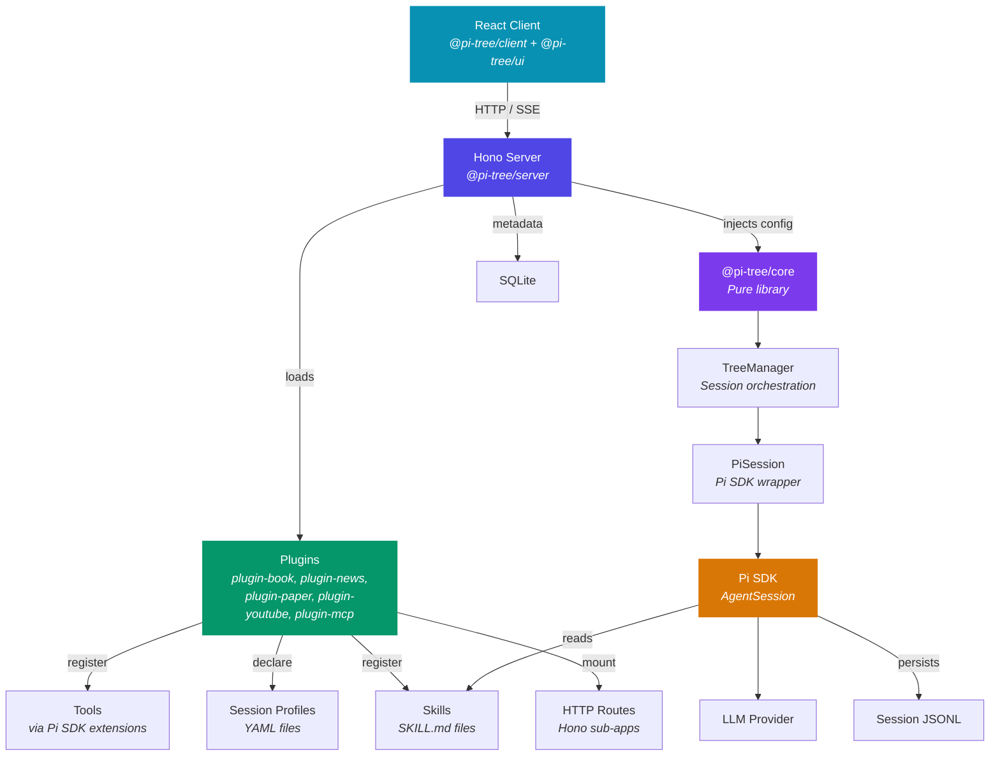
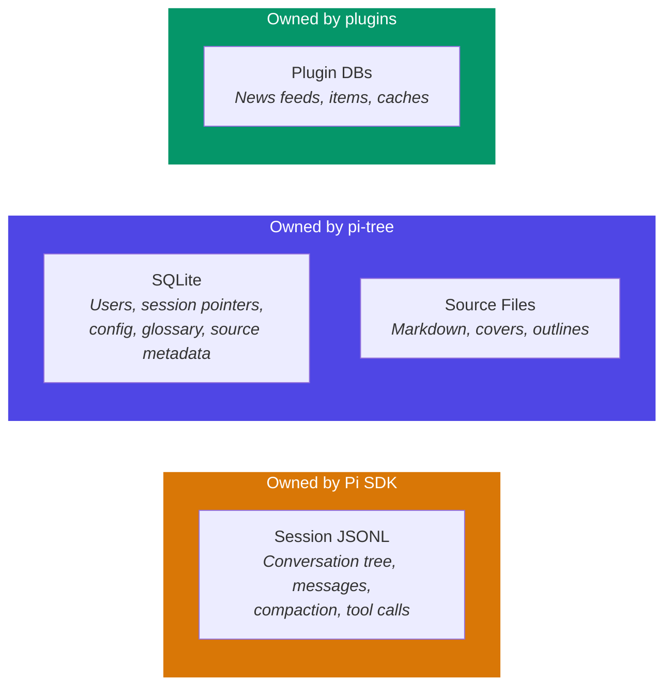

# Architecture Overview

Pi-tree is a web app built around the [Pi SDK](https://github.com/AiExperts/pi-coding-agent). AI orchestration logic lives in `@pi-tree/core` (a pure library); the server discovers and loads **plugins** that provide source-type-specific capabilities.

## How It Works



### Core — Pure AI Logic

**`@pi-tree/core`** owns all AI orchestration:

- **PiSession** wraps the Pi SDK and manages the conversation lifecycle.
- **TreeManager** orchestrates sessions — intent classification, tree operations, and PiSession coordination.
- **`configureModelRegistry()`** handles provider and model setup in an extracted, testable function.

Core is a **pure library** — no `process.env`, no file I/O. All configuration is injected via `PiSessionConfig`.

### Server — The Plugin Host

**`@pi-tree/server`** discovers and loads plugins, resolves environment variables, manages the database, and serves HTTP routes. It injects resolved configuration into core and mounts plugin-declared routes at startup.

```
packages/server/
├── src/agents/
│   ├── skills/session-router/    → Routes users to the right session
│   └── extensions/router/        → Core navigation tools (list_sources, etc.)
├── src/profiles/                 → Server-bundled session profiles (YAML)
└── src/services/agent-registry.ts → Plugin discovery and capability resolution
```

The **Agent Registry** (`agent-registry.ts`) scans plugin packages at startup, validates that all session profiles reference existing skills, and resolves the right capabilities for each session via `resolveProfile()`.

## Plugin Architecture

Each source type is a self-contained **plugin** under `packages/plugin-*/`. A plugin can provide any combination of:

- **Tools** — registered via the Pi SDK's extension API (`pi.registerTool()`)
- **Skills** — `SKILL.md` instruction files that shape AI behavior
- **Session profiles** — YAML files mapping `(sourceType, mode)` → skills + tools
- **HTTP routes** — Hono sub-apps mounted at a declared prefix
- **UI components** — React components (content panels, dashboards)
- **Source type definitions** — icon, session modes, badges, add-source form fields

Plugins depend only on `@pi-tree/plugin-sdk` — no server internals, no direct DB access.

### Plugin Manifest

Each plugin declares its capabilities in `package.json`. Here's the real manifest from `plugin-youtube`:

```json
{
  "piTree": {
    "sourceType": {
      "key": "youtube",
      "label": "YouTube",
      "icon": "circle-play",
      "sessionModes": ["watching", "custom"],
      "defaultMode": "watching"
    },
    "routes": "./routes.ts",
    "routePrefix": "/api/youtube",
    "ui": { "contentPanel": "./ui/ContentPanel.tsx" }
  },
  "pi": {
    "extensions": ["./index.ts"],
    "skills": ["./skills"]
  }
}
```

The `pi` field uses standard Pi SDK fields — `extensions` declares the extension modules (which register tools), and `skills` declares skill directories. The `piTree` field layers pi-tree-specific metadata on top: source type definition, HTTP routes, and UI components.

### Built-in Plugins

| Plugin | Source Type | Key Tools | Skills | Routes | Own DB |
|--------|------------|-----------|--------|--------|--------|
| `plugin-book` | `book` | `process_book` | `interactive-reading`, `book-outline`, `book-analysis` | — | — |
| `plugin-news` | `news` | `get_latest_rss`, `search_rss`, etc. | `news-reading` | `/api/news/*` | ✅ |
| `plugin-paper` | `paper` | `search_papers`, `get_paper_info`, `read_paper` | `paper-reading` | — | — |
| `plugin-youtube` | `youtube` | `get_youtube_info`, `get_youtube_transcript` | `youtube-watching` | `/api/youtube/*` | — |
| `plugin-mcp` | — | Dynamic (from external MCP servers) | — | — | — |

`plugin-mcp` is special — it bridges external MCP servers (configured in `$DATA_PATH/mcp.json`) and registers their tools dynamically. It has no source type of its own.

## Skills Shape Behavior

The AI doesn't have hardcoded reading logic. Instead, behavior is driven by **skill files** — markdown instruction bundles (`SKILL.md`) that the Pi SDK injects at session creation time.

Skills come from plugins. Each plugin bundles the skills relevant to its source type (e.g., `plugin-book` ships `interactive-reading`, `book-outline`, and `book-analysis`).

Discovery order (first wins on name collision):

1. **User skills** — `$DATA_PATH/skills/` (or `$SKILLS_PATH`)
2. **Plugin-bundled skills** — `packages/plugin-*/skills/`
3. **Server-bundled skills** — `packages/server/src/agents/skills/`

:::info Skill Overrides
Users can add custom skills via `$DATA_PATH/skills/`. User skills load first (the SDK uses first-wins deduplication), so they can **override plugin skills** by name. Changing a `SKILL.md` changes how the AI reads — no code changes needed.
:::

## Session Profiles

Session profiles are declarative YAML files that map `(sourceType, mode)` to a set of skills and tools. Each plugin bundles its own profiles; the server bundles the `router` profile.

| Profile | Skills | Bundled In |
|---------|--------|------------|
| `book.reading` | `[interactive-reading]` | plugin-book |
| `book.analysis` | `[book-analysis, book-outline]` | plugin-book |
| `book.qa` | `[interactive-reading]` | plugin-book |
| `news.news` | `[news-reading]` | plugin-news |
| `paper.reading` | `[paper-reading]` | plugin-paper |
| `youtube.watching` | `[youtube-watching]` | plugin-youtube |
| `_default` | `[interactive-reading]` | plugin-book |
| `router` | `[session-router]` | server |

Resolution order: `${sourceType}.${mode}` → `${sourceType}` → `_default`. `SessionContext.skills` and `SessionContext.model` from the DB override the profile.

Custom profiles can be added at `$DATA_PATH/profiles/*.yml` — user profiles win on name collision. Custom profiles can declare a `source_type` field to appear as an additional session mode for a specific source type.

## Data Ownership

Pi-tree splits data ownership between the Pi SDK and the application:



| What | Where | Owner |
|------|-------|-------|
| Conversation content (messages, tree, compaction) | `sessions/<sourceId>/<userId>/*.jsonl` | Pi SDK |
| User identity, session pointers, config | `pi-tree.db` (SQLite) | pi-tree |
| Source content (markdown, outlines, covers) | `sources/<sourceId>/markdown/` | pi-tree |
| Plugin data (feeds, caches, databases) | `plugins/<name>/` | Each plugin |
| Plugin-bundled skills & tools | `packages/plugin-*/` | Pi SDK resource loader |
| User skills (overrides) | `$DATA_PATH/skills/` | Pi SDK resource loader |

:::info Key Insight
**Pi-tree never reads or writes session JSONL directly.** It tells the Pi SDK "start session from this file" and "send this message" — the SDK manages the rest. SQLite only stores metadata that the SDK doesn't care about: which user, which source, UI config, glossary terms, and so on.
:::

## What's Next

- **[Session Management](/docs/sessions)** — How multiple sessions per user and source are created, cached, and wired to AI behavior.
- **[Self-Hosting](/docs/self-hosting)** — Custom skills, custom profiles, and environment configuration for self-hosters.
