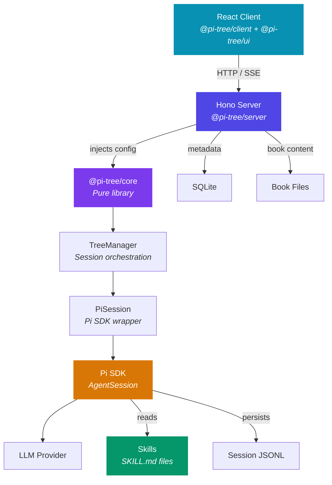
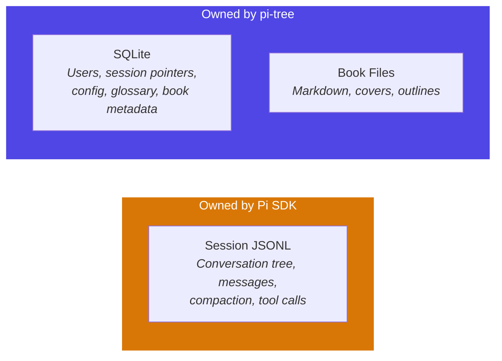

# Architecture Overview

Pi-tree is a web app built around the [Pi SDK](https://github.com/AiExperts/pi-coding-agent). AI orchestration logic lives in `@pi-tree/core` (a pure library); the server is a thin app layer that resolves configuration and delegates to core.

## How It Works



### Core — Pure AI Logic

**`@pi-tree/core`** owns all AI orchestration:

- **PiSession** wraps the Pi SDK and manages the conversation lifecycle.
- **TreeManager** orchestrates sessions — intent classification, tree operations, and PiSession coordination.
- **`configureModelRegistry()`** handles provider and model setup in an extracted, testable function.

Core is a **pure library** — no `process.env`, no file I/O. All configuration is injected via `PiSessionConfig`.

### Server — The App Layer

**`@pi-tree/server`** is the application shell. It resolves environment variables, manages the database, serves HTTP routes, and injects configuration into core.

```
packages/server/
├── src/agents/skills/   → Discovered by Pi SDK via additionalSkillPaths
├── src/agents/extensions/ → TypeScript tool bundles loaded by Pi SDK
└── src/parsers/         → Ebook parsers used by server for book uploads
```

## Skills Shape Behavior

The AI doesn't have hardcoded reading logic. Instead, behavior is driven by **skill files** — markdown instruction bundles that the Pi SDK's resource loader injects at session creation time.

5 core skills ship with the repo:

| Skill | Purpose |
|-------|---------|
| `interactive-reading` | Guided book reading flow |
| `book-outline` | Structural overview generation |
| `book-analysis` | Structured book analysis |
| `news-reading` | News feed reading flow |
| `session-router` | Routes users to the right session |

:::info Skill Overrides
Users can add custom skills via `$DATA_PATH/skills/` (or `$SKILLS_PATH`). User skills load first (the SDK uses first-wins deduplication), so they can **override core skills** by name. Changing a `SKILL.md` changes how the AI reads — no server code changes needed.
:::

## Agent Directory

All agent capabilities live under `src/agents/` — a browsable directory of what the AI can do:

```
packages/server/src/agents/
├── context.ts            ← Service locator for extension DI
├── skills/               ← Markdown instruction bundles
│   ├── interactive-reading/
│   ├── book-outline/
│   ├── book-analysis/
│   ├── news-reading/
│   └── session-router/
└── extensions/           ← TypeScript tool bundles (runtime-loaded by Pi SDK)
    ├── library/          ← list_sources, get_source_info, create_session, open_session
    ├── news/             ← get_latest_rss, search_rss, aggregate_rss, etc.
    └── mcp/              ← MCP client bridge — registers tools from external MCP servers
```

Extensions are decoupled from server internals via **`context.ts`** — a service locator that the server populates at startup. Extensions import `getExtensionServices()` from `../../context.js` instead of reaching into DB or service modules directly.

### Session Profiles

**`src/config/session-profiles.ts`** declaratively maps `(sourceType, mode)` → skills + extensions:

| Profile | Skills | Extensions |
|---------|--------|------------|
| `book.reading` | `interactive-reading` | — |
| `book.analysis` | `book-analysis`, `book-outline` | — |
| `news.news` | `news-reading` | `news` |
| `router` | `session-router` | `library` |

Resolution order: `${sourceType}.${mode}` → `${sourceType}` → `_default`. `SessionContext.skills` and `SessionContext.model` from the DB override the profile.

## Data Ownership

Pi-tree splits data ownership cleanly between the Pi SDK and the application:



| What | Where | Owner |
|------|-------|-------|
| Conversation content (messages, tree, compaction) | `sessions/<bookId>/<userId>/*.jsonl` | Pi SDK |
| User identity, session pointers, config | `pi-tree.db` (SQLite) | pi-tree |
| Book content (markdown, outlines, covers) | `library/` or `books/` | pi-tree |
| Core skills & extensions | `packages/server/src/agents/` | Pi SDK resource loader |
| User skills (overrides) | `$DATA_PATH/skills/` or `$SKILLS_PATH` | Pi SDK resource loader |

:::info Key Insight
**Pi-tree never reads or writes session JSONL directly.** It tells the Pi SDK "start session from this file" and "send this message" — the SDK manages the rest. SQLite only stores metadata that the SDK doesn't care about: which user, which book, UI config, glossary terms, and so on.
:::

## What's Next

- **[Session Management](/docs/sessions)** — How multiple sessions per user and source are created, cached, and wired to AI behavior.
