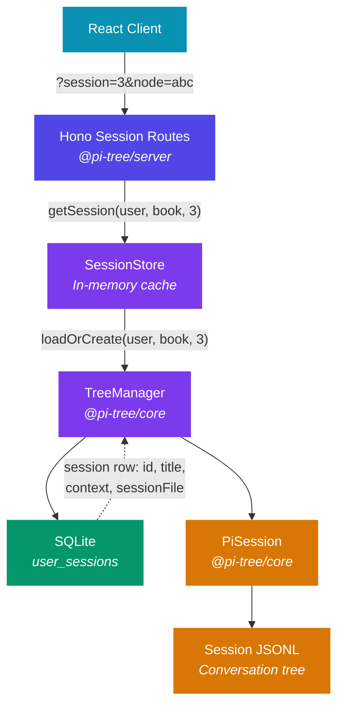
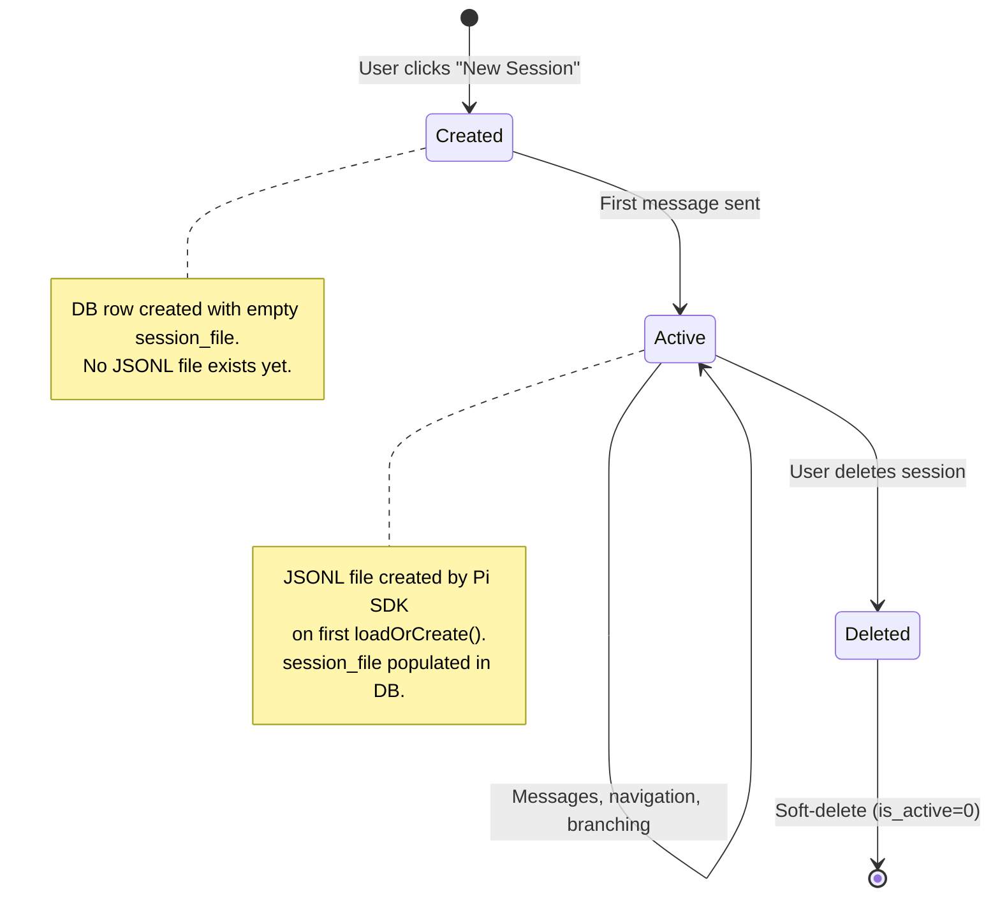

# Session Management

How pi-tree manages reading sessions — the bridge between users, sources, and AI agent conversations.

## Core Concept

Each user can have **multiple independent sessions per source**. A session is a complete conversation tree backed by a Pi SDK JSONL file. Different sessions can represent different approaches to the same source — guided reading, Q&A, deep dives, and more.

```
User ──┬── Book A ──┬── Session 1 (Interactive Reading)
       │            ├── Session 2 (Freeform Q&A)
       │            └── Session 3 (Chapter 5 Deep Dive)
       │
       └── Book B ──┬── Session 1 (Interactive Reading)
                    └── Session 2 (Study Group Notes)
```

## Architecture

The session system spans the client, server, and core packages. For a high-level view of the full stack, see the [Architecture Overview](/docs/architecture).



## Data Model

### Database: `user_sessions`

| Column | Type | Description |
|--------|------|-------------|
| `id` | INTEGER PK | Session identifier (auto-increment) |
| `user_id` | TEXT FK | References `users.id` |
| `source_id` | TEXT | Source identifier |
| `title` | TEXT | Human-readable session name |
| `context` | TEXT (JSON) | `SessionContext` blob — session configuration |
| `session_file` | TEXT | Absolute path to Pi SDK JSONL file |
| `is_active` | INTEGER | 1 = active, 0 = soft-deleted |
| `created_at` | TEXT | ISO 8601 timestamp |
| `last_active_at` | TEXT | Updated on each message |

### SessionContext

```typescript
interface SessionContext {
  mode: 'reading' | 'analysis' | 'news' | 'custom';
  systemPrompt?: string;   // Optional prompt override
  skills?: string[];        // Optional skill filter
  model?: string;           // Optional model override
}
```

The `context` column captures the **intent** of the session at creation time. This enables per-session behavior configuration.

:::info Session Profiles
Session behavior is driven by **session profiles** — declarative mappings of `(sourceType, mode)` → skills, extensions, model. The server resolves profiles via `resolveProfile(sourceType, mode, sessionContext)` in `src/config/session-profiles.ts`. `SessionContext.skills` and `SessionContext.model` stored in the DB override the profile defaults. See [Context Binding](#context-binding) for details.
:::

## Session Lifecycle



The lifecycle has four key steps:

1. **Create** — `POST /api/sessions/:userId/:sourceId` creates a DB row with a title and context. No JSONL file exists yet.
2. **First load** — `TreeManager.loadOrCreate(userId, sourceId, sessionId)` triggers the Pi SDK to create the JSONL file. The path is stored back in `session_file`.
3. **Resume** — Subsequent loads find the `session_file` from the database and pass it to `SessionManager.open()`.
4. **Delete** — Soft-delete sets `is_active = 0`. JSONL files are preserved for potential recovery.

## In-Memory Session Cache

`SessionStore` keeps active `TreeManager` instances in memory to avoid re-creating Pi SDK sessions on every HTTP request.

```
Key: "userId:sourceId:sessionId" → TreeManager instance
```

Only one `TreeManager` exists per unique session. When a session is closed or deleted, it's evicted from the cache.

## Context Binding

A session's AI behavior is shaped by **session profiles** — declarative mappings resolved at session creation time. The server resolves the profile via `resolveProfile(sourceType, mode, sessionContext)` in `src/config/session-profiles.ts`.

| Layer | What | How It Works |
|-------|------|--------------|
| **Skills** | SKILL.md instruction bundles | Profile selects skills per `(sourceType, mode)`. `SessionContext.skills` overrides the profile. |
| **Extensions** | Tool bundles (TypeScript, runtime-loaded) | Profile selects extensions (e.g., `[news]` for news mode, `[library]` for router). |
| **System prompt** | Deferred context injected on first message | Override via `context.systemPrompt`. |
| **Model** | LLM provider + model ID | Profile may set a default model. `SessionContext.model` overrides it. |

### Profile Resolution

Resolution order: `${sourceType}.${mode}` → `${sourceType}` → `_default`.

Built-in profile examples:

| Profile Key | Skills | Extensions |
|-------------|--------|------------|
| `book.reading` | `[interactive-reading]` | — |
| `book.analysis` | `[book-analysis, book-outline]` | — |
| `news.news` | `[news-reading]` | `[news]` |
| `router` | `[session-router]` | `[library]` |

Custom profiles can be added at `$DATA_PATH/profiles/*.yml` with an optional `source_type` field to scope them to specific source types.

### How It Works

Each session gets its configuration from the resolved profile, with `SessionContext` overrides applied:

```
PiSession.create(config, resolvedProfile)   // @pi-tree/core
  ├── configureModelRegistry()
  │
  ├── Skills and extensions resolved by profile:
  │   ├── Core: packages/server/agents/skills/   (built-in)
  │   ├── Core: packages/server/agents/extensions/ (built-in)
  │   ├── User: DATA_PATH/skills/                (overrides on name collision)
  │   └── User: DATA_PATH/extensions/            (user-provided)
  │
  ├── createAgentSession() with:
  │   ├── model: context.model ?? profile.model ?? config.readingModel
  │   ├── tools: profile.extensions + excludeTools filtering
  │   └── resourceLoader: profile.skills (filtered)
  │
  └── pendingContext = context.systemPrompt ?? defaultSourceContext
```

## API Reference

### Session Management (CRUD)

| Method | Path | Description |
|--------|------|-------------|
| `GET` | `/api/sessions/:userId/:sourceId` | List all sessions |
| `POST` | `/api/sessions/:userId/:sourceId` | Create a new session |
| `PUT` | `/api/sessions/:userId/:sourceId/:sessionId` | Update title/context |
| `DELETE` | `/api/sessions/:userId/:sourceId/:sessionId` | Soft-delete |

### Session Interaction

All interaction endpoints accept `sessionId` in the request body. When omitted, they default to the most recently active session.

| Method | Path | Description |
|--------|------|-------------|
| `POST` | `/api/session/start` | Start or resume a session |
| `POST` | `/api/session/message/stream` | Send message (SSE streaming) |
| `POST` | `/api/session/view` | View a tree scope |
| `POST` | `/api/session/navigate` | Navigate to a node |
| `POST` | `/api/session/reset` | Reset a session |

### URL Structure

```
/source/:sourceId?session=<sessionId>&node=<nodeId>
```

When no `?session=` parameter is present, the UI shows the session picker.

## Future Extensibility

This architecture is designed to generalize beyond book reading. The session management layer is intentionally decoupled from source-specific logic:

| Concept | Book Reading | Future Agent Sessions |
|---------|-------------|----------------------|
| **Session** | A conversation tree about a book | A conversation tree about any task |
| **Context** | Mode (reading/analysis/news), source-specific prompt | Task type, tool set, system prompt |
| **Skills** | Reading skills (interactive-reading, deep-dive) | Development skills, analysis skills |
| **Model** | Reading model (may prefer longer context) | Task-appropriate model selection |
| **JSONL** | Pi SDK session file | Same — Pi SDK session file |

The `SessionContext` type is intentionally flexible — `mode` can be extended to any string, `skills` and `model` are optional overrides. New agent types can add their own context fields without schema changes (the JSON blob is schemaless in SQLite).

### Extension Points for Developers

:::tip Customization Options
1. **Add a new mode** — Extend the `mode` union type, create a matching session profile in `$DATA_PATH/profiles/`.
2. **Custom system prompt** — Set `context.systemPrompt` when creating a session.
3. **Skill filtering** — Set `context.skills = ['my-custom-skill']` to override which skills are active for the session.
4. **Model selection** — Set `context.model` to use a different LLM for specific session types.
5. **New context fields** — Add fields to `SessionContext` — the JSON column handles arbitrary shapes.
6. **Custom profiles** — Create `$DATA_PATH/profiles/*.yml` with optional `source_type` scoping.
:::
